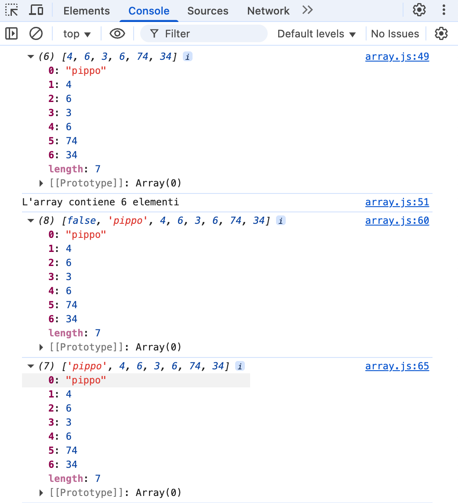
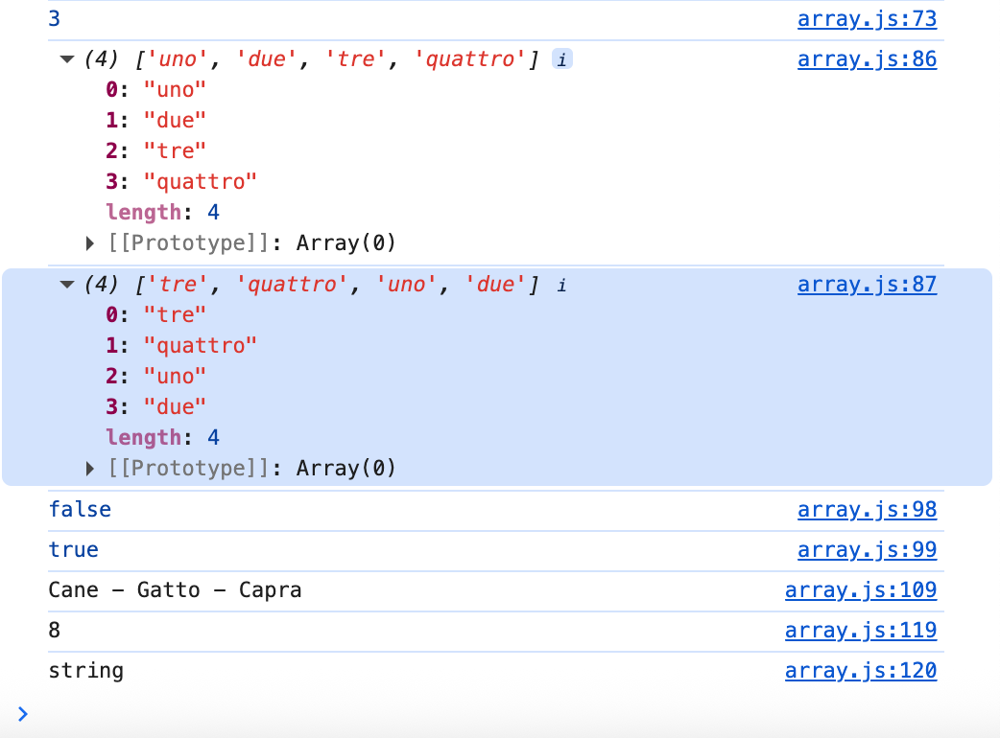

# Esercizi con gli ARRAY
*Ottobre 2025* 👩🏻‍💻

---




---

⚒️


| Nome | Linguaggio | Versione |
|------|------------|----------|
| HTML |Markup      | 5        |
| CSS  |Style       | 4        |
| Java |Scripting   | ES15     |

---

👩🏻‍💻

```
Avviare Golive su VSCode
